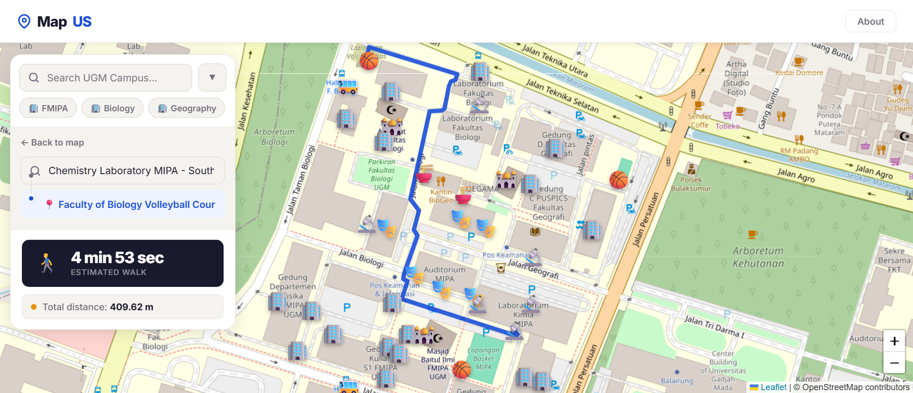
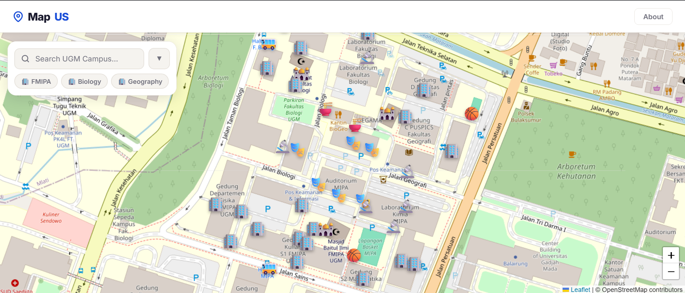
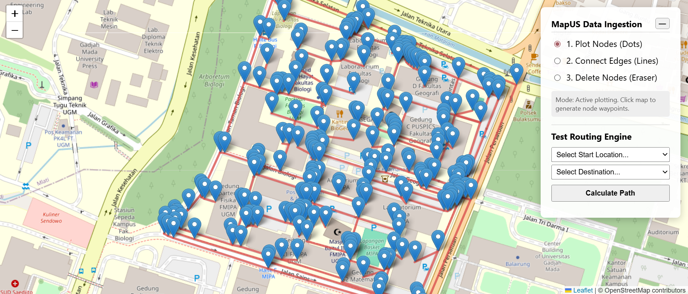

<<<<<<< HEAD
# 🗺️ MapUS — UGM Campus Navigation System

<div align="center">
  
</div>

<br>

> **MapUS** is a high-performance, web-based spatial navigation engine developed specifically for **Universitas Gadjah Mada (UGM)**, Yogyakarta. Built to solve campus navigation challenges, it calculates the most efficient walking routes between buildings, gates, and facilities using graph theory and mathematical pathfinding.

### 🔗 Live Links
* 🔴 **Video Demonstration:** [Watch on YouTube](https://youtu.be/KWc-SZ-gAXY)
* 🌐 **Live Live Website:** [MapUS Production Server](https://lucaacamilioo.pythonanywhere.com/)


## 🚀 About the Project
This application was developed as a Final Project for **CS50: Introduction to Computer Science** by Harvard University (via edX). 

MapUS models the physical pathways of the UGM Bulaksumur campus as a complex mathematical graph. By plotting intersections, buildings, and campus gates as "Nodes" and the physical walking paths between them as "Edges," the application dynamically computes the absolute shortest physical route for students and visitors navigating the university grounds.


## 📸 Interface Preview

### The Public Explorer
<div align="center">
  
  <p><i>The public-facing map with dynamic search, fast-access campus shortcuts, and routing UI.</i></p>
</div>

### The Admin Dashboard
<div align="center">
  
  <p><i>The secured administrative panel for database ingestion, node destruction, and route testing.</i></p>
</div>


## 🛠️ Core Features & Page Breakdown

### 1. Public Navigation Page (`/`)
The frontend is built to feel like a native, premium navigation app (similar to Google Maps), optimized for both desktop and mobile devices.
* **Interactive Web Map:** Powered by Leaflet.js, featuring custom icons for different campus categories (Mosques, Canteens, Faculties, Gates).
* **Double Search Engine:** Users can search for both their starting point and destination using a responsive, auto-filtering list.
* **Smart Map Clicks:** Users can bypass the search bar entirely by clicking on building icons directly on the map to set their origin or destination.
* **Turn-by-Turn Metrics:** Displays total path traversal distance (in meters) and calculates estimated walking time based on a standard 1.4 m/s pedestrian speed.

### 2. Admin Control Panel (`/admin-dashboard`)
A protected dashboard strictly for database and map management, hidden behind an HTTP Basic Auth wall.
* **Visual Node Ingestion:** Administrators can click anywhere on the map to drop a pin, extract the exact Latitude/Longitude, assign a category, and save the physical location directly to the SQLite database.
* **Smart Deletion:** Clicking an existing node on the admin map automatically captures its ID. Deleting a node automatically triggers a cascade deletion of all "orphaned" edges connected to it to prevent database corruption.
* **Routing Test Engine:** Allows the admin to force-test Dijkstra's algorithm between two specific Node IDs to verify graph integrity without using the public UI.


## 🧠 The Mathematics & Logic (Under the Hood)

### Dijkstra's Shortest Path Algorithm
The backend routing engine does not rely on external APIs like Google Maps. Instead, it builds an adjacency list (a mathematical Graph) using custom `Vertex` and `Edge` classes in Python. It then utilizes **Dijkstra's Algorithm** paired with a `heapq` (Priority Queue) to explore the network and guarantee the shortest distance between the start and end nodes.

### The Haversine Formula
Because the Earth is a sphere, we cannot calculate distance using standard flat-plane geometry (Pythagorean theorem). The backend uses the **Haversine Formula** to calculate the great-circle distance between two GPS coordinates (Latitude/Longitude), providing highly accurate meter-based edge weights for the algorithm.

To determine the great-circle distance between two coordinate points on a spherical surface (Latitude and Longitude), the routing engine computes the following mathematical operations:

Given two points $(\text{lat}_1, \text{lon}_1)$ and $(\text{lat}_2, \text{lon}_2)$, we first convert the coordinates from degrees to radians:
$$\Delta \phi = \text{rad}(\text{lat}_2 - \text{lat}_1)$$
$$\Delta \lambda = \text{rad}(\text{lon}_2 - \text{lon}_1)$$

The square of the half-chord length between the points ($a$) is calculated as:
$$a = \sin^2\left(\frac{\Delta \phi}{2}\right) + \cos(\phi_1) \cdot \cos(\phi_2) \cdot \sin^2\left(\frac{\Delta \lambda}{2}\right)$$

The angular distance in radians ($c$) is then computed using the central angle:
$$c = 2 \cdot \operatorname{atan2}\left(\sqrt{a}, \sqrt{1-a}\right)$$

Finally, the physical distance ($d$) in meters is resolved by multiplying with the Earth's mean radius ($R = 6,371,000\text{ m}$):
$$d = R \cdot c$$


## 📚 Technology Stack & Libraries

### Frontend Architecture
* **HTML5 / CSS3:** Custom-built, responsive UI with CSS variables, Flexbox layouts, and mobile-first media queries.
* **Vanilla JavaScript:** Handles state management, UI transitions, and asynchronous API communication (`fetch`) without heavy frameworks like React.
* **Leaflet.js:** An open-source JavaScript library used for mobile-friendly interactive maps.
* **OpenStreetMap (OSM):** Provides the free, open-source underlying map tile layer.


### Backend Architecture
* **Python 3.10:** The core logic engine.
* **Flask:** A lightweight WSGI web application framework used to build the API endpoints and serve HTML templates.
* **SQLite3 (via `cs50` library):** A C-language library that implements a small, fast, self-contained, high-reliability SQL database engine to store all Node and Edge data.


### Security & Production Libraries
* **Flask-Limiter:** Protects the routing and database APIs from DDoS attacks and brute-force spam by limiting the number of requests an IP address can make (e.g., `60 per minute` for routing, `5 per minute` for deletions).
* **Flask-HTTPAuth:** Secures the `/admin` portal with Basic Authentication.
* **python-dotenv:** Keeps sensitive credentials (`ADMIN_USERNAME`, `ADMIN_PASSWORD`) out of the source code by loading them from a hidden `.env` file.


## ⚙️ How to Implement / Run Locally

To run this project on your local machine, follow these precise steps:

**1. Clone the Repository**
```bash
git clone https://github.com/lucaacamilioo/mapus.git
cd mapus
```

**2. Set Up a Virtual Environment (Recommended)**
```bash
python -m venv venv
# On Windows:
venv\Scripts\activate
# On Mac/Linux:
source venv/bin/activate
```

**3. Install Dependencies**
```bash
pip install -r requirements.txt
```

**4. Configure Environment Variables**
Create a new file named .env in the root directory and add your secure admin credentials:
```bash
ADMIN_USERNAME=your_admin_name
ADMIN_PASSWORD=your_secure_password
```

**5. Boot the Server**
You can run the web application by executing the following command lines:
```bash
flask run
```
or
```bash
python app.py
```
The public application will be available at: http://127.0.0.1:5000

The admin panel will be available at: http://127.0.0.1:5000/admin-dashboard


## 🛡️ Security Measures Highlight
This project was built with production-grade security concepts in mind:

Input Validation: All API inputs are strictly type-cast to integers. If a malicious user sends strings or SQL injection attempts via the frontend JSON payload, the backend instantly rejects it with a 400 Bad Request.

Rate Limiting: In-memory tracking prevents automated scripts from overloading the Dijkstra calculator or spamming the database with fake nodes.

Environment Isolation: The .gitignore file strictly blocks the .env file and __pycache__ from being uploaded to GitHub, ensuring secret keys remain localized to the host server.

## 👨‍💻 Author
Noven Miletano Argani Herlambang (Camilio).
Incoming Computer Science Student (IUP) at Universitas Gadjah Mada (UGM).

Developed as a final project submission for CS50x. Special thanks to David J. Malan, Brian Yu, and the Harvard CS50 staff.